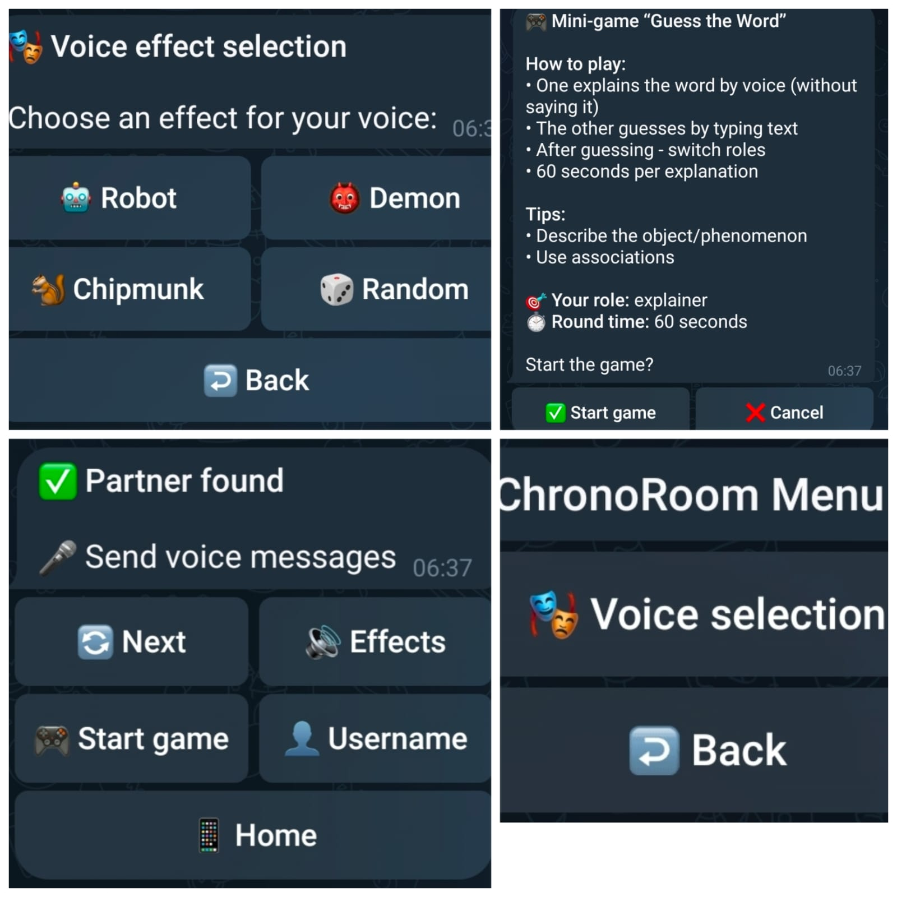

# ChronoRoom — Voice Chat Telegram Bot

A Telegram bot for anonymous voice conversations with random partners, voice effects, and an interactive mini-game.

## 📸 Demo



## ✨ Features

- 🎤 Random partner search with a timeout
- 🔊 Anonymous voice communication (the bot relays voice messages, partners never see each other's accounts)
- 🎭 Voice effects processed with FFmpeg: Robot, Demon, Chipmunk, or Random (changes automatically)
- 📌 A voice you pick yourself is kept across partners and is not overridden by the automatic change
- 🎮 "Guess the Word" mini-game with roles, rounds, a timer and a score
- 🔄 Switch to another partner at any time
- 👤 Username exchange only if the partner explicitly agrees
- 🔐 Telegram channel subscription check (optional)
- 💾 SQLite storage for usage statistics and finished games

## 🔄 How It Works

1. The user opens the bot and passes the subscription check (if enabled).
2. The bot looks for another user who is searching; if nobody is there, the user waits for up to 30 seconds.
3. Once paired, the partners exchange voice messages. Each message is optionally processed with the sender's voice effect and relayed by the bot.
4. Either partner can switch to a new partner, start the mini-game or ask the other to reveal a username.

## 🎮 Mini-Game

**Guess the Word**

- Both players confirm the start; one gets a secret word and the other guesses.
- The explainer describes the word with voice messages, the guesser answers with text.
- A correct answer scores a point, the roles switch and a new word is picked.
- If the 60-second round ends without a correct answer, the roles switch too.
- When the game ends, the result is stored and the player with the higher score is credited with a win.

## 🔊 Voice Processing

Effects are pitch/speed shifts applied with FFmpeg and re-encoded to Opus. If processing fails, the original voice message is sent (and the sender is told).

Voice messages come from untrusted clients, so the FFmpeg call is hardened (`voice.py`):

- the Ogg demuxer is forced, so FFmpeg does not parse playlists or other containers disguised as `.ogg`;
- the amount of input read is capped, because the `duration` of a voice message is reported by the sender's client; the file size is checked as well;
- tags of the source file are not forwarded to the partner;
- FFmpeg is started without a shell, with a timeout, and temporary files are deleted afterwards.

## 🧵 Concurrency

pyTelegramBotAPI runs handlers in worker threads, and the bot also uses timer threads (search and round timeouts) and a background thread for voice rotation.

All shared in-memory state (search queue, dialogues, effects, game sessions) lives in one object, `ChatState` (`state.py`), guarded by one re-entrant lock. Handlers cannot touch the data directly; every operation is a single atomic transition (for example "pair with a waiting user or join the queue", "check the guess, score it and switch roles"). No network, database or FFmpeg call is made while the lock is held. The test suite includes multi-threaded stress tests that check the invariants (dialogues are symmetric, nobody waits and talks at the same time, a game exists only inside a dialogue).

## 🧩 Project Structure

```
ChronoRoom-Bot3/
├── README.md
├── .env.example
├── .gitignore
├── screenshots/
│   └── demo.jpg
├── tests/
│   ├── test_database.py
│   ├── test_state.py
│   └── test_voice.py
├── bot.py
├── config.py
├── database.py
├── state.py
├── voice.py
└── requirements.txt
```

| File | Purpose |
| --- | --- |
| `bot.py` | Telegram handlers, keyboards, matchmaking and game flow |
| `state.py` | Thread-safe in-memory state: queue, dialogues, effects, games |
| `voice.py` | FFmpeg voice effects |
| `database.py` | SQLite statistics |
| `config.py` | Settings (environment variables and feature constants) |
| `tests/` | Unit tests (standard library `unittest`) |

## 🛠 Tech Stack

- Python 3
- pyTelegramBotAPI
- SQLite
- FFmpeg (with libopus)
- threading

## 🔒 Configuration

Secrets are read from environment variables or from a local `.env` file (git-ignored). Copy the template and fill it in:

```bash
cp .env.example .env
```

| Variable | Required | Description |
| --- | --- | --- |
| `BOT_TOKEN` | yes | Bot token from [@BotFather](https://t.me/BotFather) |
| `CHANNEL_ID` | no | Channel to check: numeric id (`-100…`) or `@channelname`. The bot must be an admin there. Empty disables the check. |
| `CHANNEL_LINK` | with `CHANNEL_ID` | Link for the "Subscribe" button |
| `CHECK_SUBSCRIPTION` | no | `0` disables the check (default `1`) |

Other settings (search timeout, round time, maximum voice duration and size, effects, game words) are constants in `config.py`.

The subscription is required for searching, not only for `/start`. If Telegram cannot confirm the membership, access is not granted.

## 💾 Data

SQLite (`chronoroom.db`, created on first start) stores the Telegram user id, username, counters (searches, connections, game wins) and finished games. Voice messages are only written to `temp_audio/` while being processed and are deleted afterwards (unless `SAVE_VOICE_FILES` is switched on). The database file contains personal data and is excluded from git.

## 🚀 Running the Bot

FFmpeg with libopus must be installed. Without it the bot still works, but voice messages are relayed without effects.

```bash
pip install -r requirements.txt
python bot.py
```

## ✅ Tests

```bash
python -m unittest discover -s tests -v
```

The FFmpeg tests are skipped automatically if FFmpeg with libopus is not available.

## 📌 About

ChronoRoom-Bot3 is one of several independent Telegram bots created for the ChronoRoom project.
